# Gali — Microservices Architecture

## From Monolith to Microservices

````carousel
### Before: Monolith
```
Gali/
├── agent/
│   ├── server.py       ← ALL routes in one FastAPI app
│   ├── llm.py          ← Gemini client
│   ├── vectorstore.py  ← LanceDB wrapper
│   ├── history.py      ← MongoDB history
│   ├── config.py       ← Settings
│   ├── prompt.py       ← System prompt
│   └── logger.py       ← Custom logging
├── ingestion/
│   └── main.py         ← CLI script
├── ui/
│   └── app.py          ← Streamlit UI
└── pyproject.toml
```
**One process, one server, everything coupled.**
<!-- slide -->
### After: Microservices
```
Gali/
├── shared/             ← DB API (Lambda Layer)
│   ├── db.py
│   ├── pii.py
│   └── config.py
├── endpoints/          ← 3 API Lambdas
│   ├── session/
│   ├── chat/
│   └── cleanup/
├── data/               ← Ingestion Lambda
│   └── handler.py
└── frontend/           ← Next.js (React)
    └── src/
```
**5 independent services, each deploys separately.**
````

---

## Architecture Overview

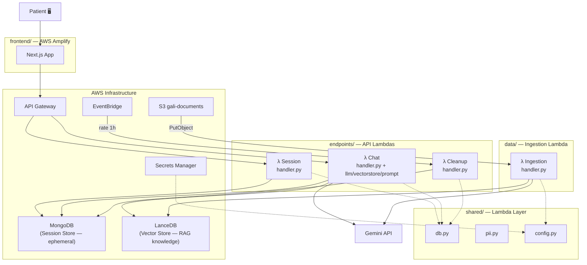

---

## Full Folder Structure

```
Gali/
│
├── shared/                          ← SHARED DATA LAYER (Lambda Layer)
│   ├── db.py                        ← MongoDB session store (chat history ONLY — not RAG)
│   ├── pii.py                       ← PII scrubbing (IDs, phones, emails)
│   └── config.py                    ← Secrets Manager helper + env settings
│
├── endpoints/                       ← API LAMBDAS (future repo: gali-api)
│   │
│   ├── session/                     ← λ1 — Session Service
│   │   ├── handler.py               ← GET /session/new + GET /history/{id}
│   │   └── requirements.txt         ← aws-lambda-powertools, pymongo
│   │
│   ├── chat/                        ← λ2 — Chat Agent Service
│   │   ├── handler.py               ← POST /chat (RAG pipeline)
│   │   ├── requirements.txt         ← powertools, google-genai, lancedb, pymongo
│   │   ├── llm.py                   ← Gemini client (embed + generate)
│   │   ├── vectorstore.py           ← LanceDB search
│   │   └── prompt.py                ← System prompt (Gali persona)
│   │
│   └── cleanup/                     ← λ4 — Cleanup Service
│       ├── handler.py               ← Scheduled: delete messages > 24h
│       └── requirements.txt         ← aws-lambda-powertools, pymongo
│
├── data/                            ← INGESTION LAMBDA (future repo: gali-data)
│   ├── handler.py                   ← S3 trigger: PDF → extract → chunk → embed → store
│   └── requirements.txt             ← powertools, pdfplumber, google-genai, lancedb
│
└── frontend/                        ← NEXT.JS APP (future repo: gali-frontend)
    ├── package.json
    ├── next.config.js
    └── src/
        ├── app/
        │   ├── layout.tsx           ← RTL, fonts, global styles
        │   └── page.tsx             ← Main chat page
        ├── components/
        │   ├── ChatBubble.tsx       ← Message bubble component
        │   ├── ChatInput.tsx        ← Input bar + send button
        │   ├── Header.tsx           ← Green header "גלי"
        │   └── Sidebar.tsx          ← About + disclaimer
        └── lib/
            └── api.ts               ← API Gateway call functions
```

---

## UML — Shared Layer

> **MongoDB = Session Store only.** It holds ephemeral chat messages (deleted after 24 h).
> **LanceDB = Vector Store (RAG).** It holds embedded medical/protocol documents.
> No vector search or RAG is ever performed on MongoDB.

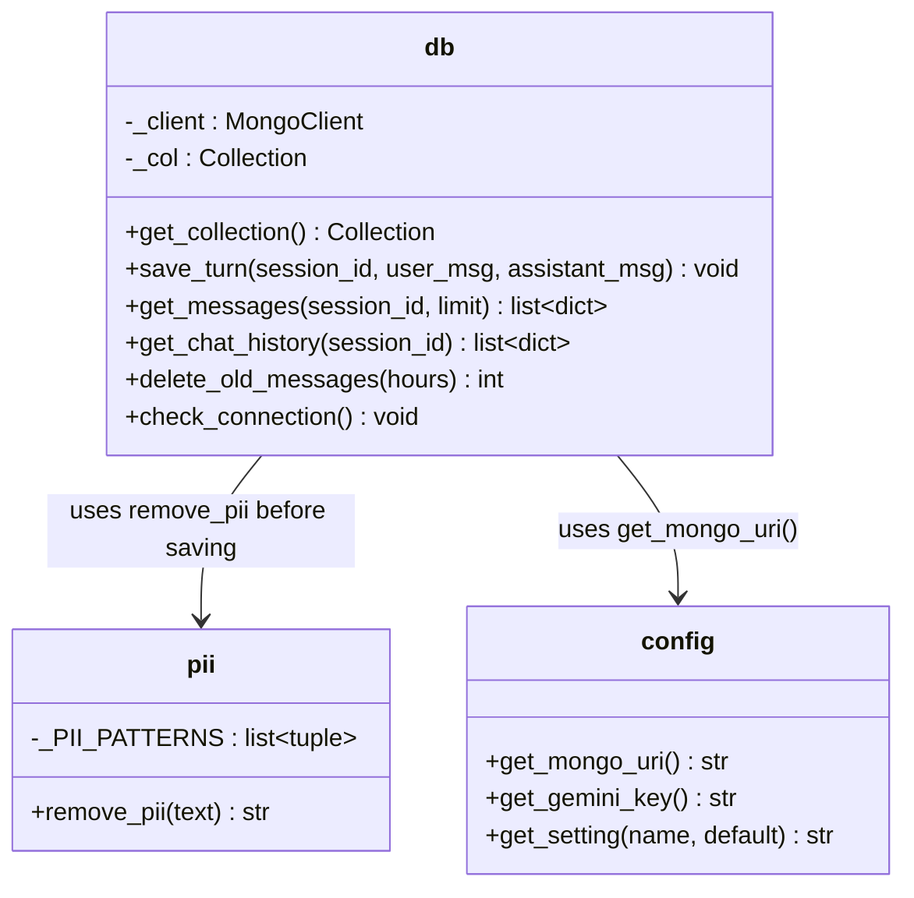

### What each function does:

| File | Function | Description |
|------|----------|-------------|
| **db.py** | `get_collection()` | Returns MongoDB `chat_history` collection — **session store only** (lazy connects) |
| | `save_turn(sid, user, bot)` | Scrubs PII → adds `created_at` timestamp → inserts both messages |
| | `get_messages(sid, limit=20)` | Returns last N session messages oldest-first `[{role, content}]` — plain list, no vectors |
| | `get_chat_history(sid)` | Returns session messages as Gemini-format list — **conversation memory, NOT RAG retrieval** |
| | `delete_old_messages(hours=24)` | Deletes ephemeral messages where `created_at < now - hours` → returns count |
| | `check_connection()` | Pings MongoDB to verify connectivity |
| **pii.py** | `remove_pii(text)` | Regex-scrubs Israeli IDs (9 digits), phone numbers, emails |
| **config.py** | `get_mongo_uri()` | Fetches `/gali/MONGO_URI` from Secrets Manager (cached 5 min) |
| | `get_gemini_key()` | Fetches `/gali/GEMINI_API_KEY` from Secrets Manager (cached 5 min) |
| | `get_setting(name, default)` | Reads env var with fallback |

---

## UML — Session Service (λ1)

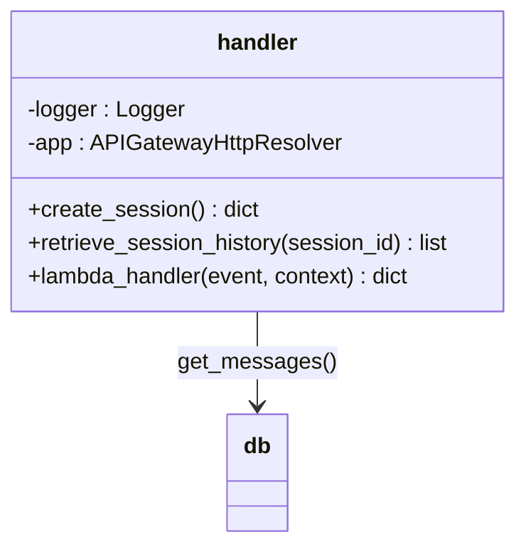

| Function | Route | Description |
|----------|-------|-------------|
| `create_session()` | `GET /session/new` | Generates UUID v4, returns `{session_id}` |
| `retrieve_session_history()` | `GET /history/<session_id>` | Calls `shared.db.get_messages()` → returns messages list |
| `lambda_handler()` | — | Entry point, resolves API Gateway event to route |

---

## UML — Chat Agent Service (λ2)

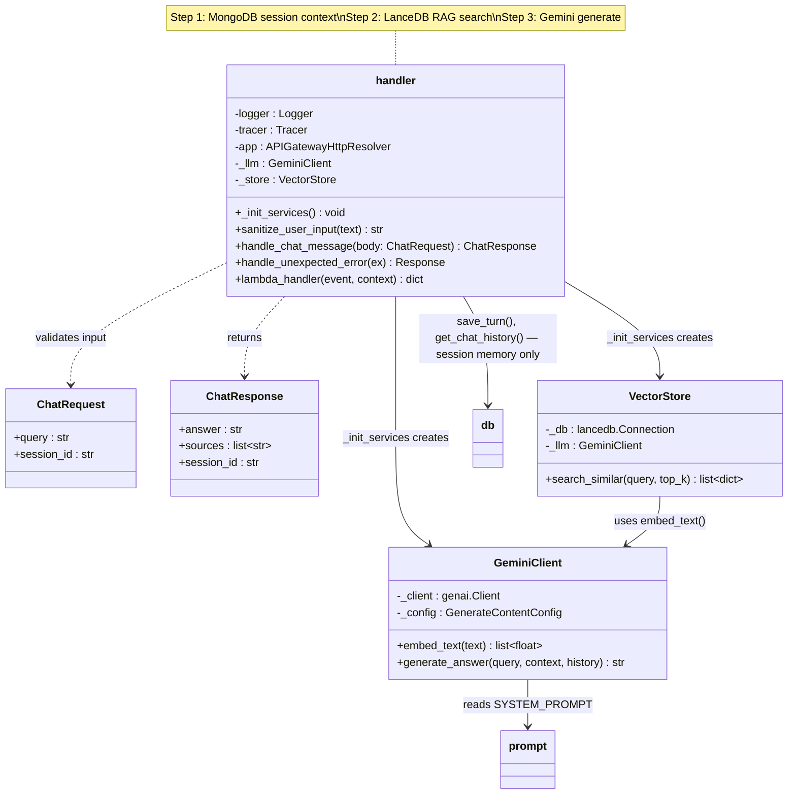

| File | Function | Description |
|------|----------|-------------|
| **handler.py** | `_init_services()` | Lazy-init GeminiClient + VectorStore (reused across warm invocations) |
| | `sanitize_user_input(text)` | NFKC normalize → strip invisible chars → detect injection patterns |
| | `handle_chat_message(body)` | **3-step flow:** ① fetch session history from MongoDB ② search LanceDB for RAG knowledge ③ generate via Gemini with both contexts → save → respond |
| **llm.py** | `GeminiClient.__init__()` | Connects to Gemini API, sets system_instruction |
| | `embed_text(text)` | Returns 768-dim embedding vector |
| | `generate_answer(query, ctx, history)` | Creates chat with history → sends context+query → retries on 503/429 |
| **vectorstore.py** | `VectorStore.__init__(llm)` | Connects to LanceDB (S3 path) |
| | `search_similar(query, top_k=4)` | Embeds query → searches LanceDB → returns top-k chunks |
| **prompt.py** | `SYSTEM_PROMPT` | Gali persona: Hebrew medical coordinator, triage rules, disclaimers |

---

## UML — Ingestion Service (λ3)

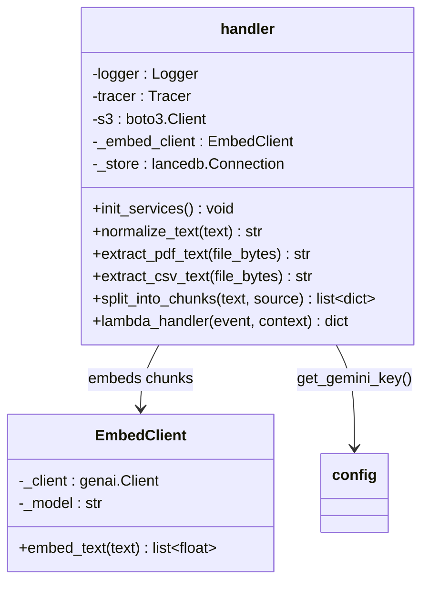

| Function | Description |
|----------|-------------|
| `lambda_handler(event)` | Reads S3 event → downloads file → processes → stores in LanceDB |
| `init_services()` | Lazy-init Gemini embed client + LanceDB connection |
| `extract_pdf_text(bytes)` | pdfplumber: extract text + tables from PDF bytes |
| `extract_csv_text(bytes)` | Decode CSV bytes to cleaned text |
| `normalize_text(text)` | Strip junk chars, collapse whitespace, remove bullets |
| `split_into_chunks(text, source)` | Split into 800-char chunks with 200-char overlap |

---

## UML — Cleanup Service (λ4)

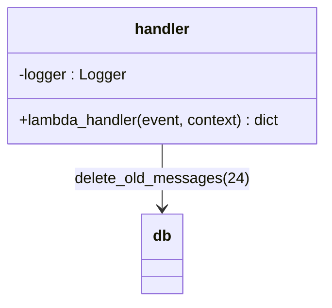

| Function | Description |
|----------|-------------|
| `lambda_handler(event)` | Calls `shared.db.delete_old_messages(24)` → logs count → returns |

---

## UML — Frontend

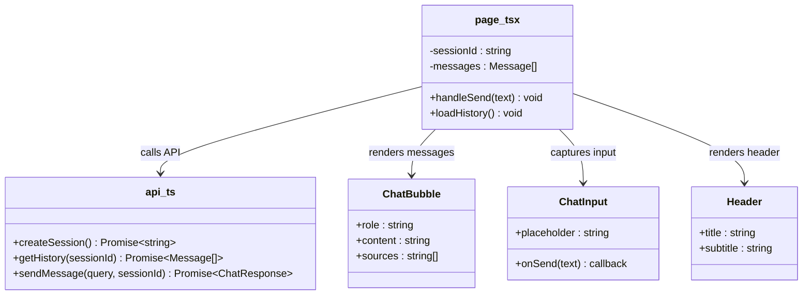

| File | Function | Description |
|------|----------|-------------|
| **api.ts** | `createSession()` | `GET /session/new` → returns session UUID |
| | `getHistory(sid)` | `GET /history/{sid}` → returns messages array |
| | `sendMessage(query, sid)` | `POST /chat` → returns `{answer, sources}` |
| **page.tsx** | `handleSend(text)` | Appends user message → calls API → appends bot response |
| | `loadHistory()` | On mount: creates session or loads existing history |
| **ChatBubble** | — | Renders single message (RTL, Hebrew, markdown, source tags) |
| **ChatInput** | — | Input bar with send button, placeholder in Hebrew |
| **Header** | — | Green banner: "גלי — עוזרת AI גינקולוגיה" |

---

## Flow Diagrams

### Chat Flow (λ2)

> **3-step flow:** MongoDB (session memory) + LanceDB (RAG knowledge) → Gemini

```mermaid
sequenceDiagram
    participant UI as Frontend
    participant GW as API Gateway
    participant Chat as λ2 Chat
    participant Mongo as MongoDB (Session Store)
    participant Lance as LanceDB (Vector Store / RAG)
    participant Gemini as Gemini API

    UI->>GW: POST /chat {query, session_id}
    GW->>Chat: invoke
    Chat->>Chat: sanitize_user_input(query)

    rect rgb(40, 40, 80)
    Note right of Chat: Step 1 — Session context (MongoDB)
    Chat->>Mongo: get_chat_history(session_id)
    Mongo-->>Chat: messages[] (plain list, last 24h)
    end

    rect rgb(40, 80, 40)
    Note right of Chat: Step 2 — Knowledge retrieval (LanceDB RAG)
    Chat->>Lance: search_similar(query)
    Lance-->>Chat: top 4 document chunks
    end

    rect rgb(80, 40, 40)
    Note right of Chat: Step 3 — Generate (Gemini)
    Chat->>Gemini: generate_answer(query, docs, session_history)
    Gemini-->>Chat: answer
    end

    Chat->>Mongo: save_turn(session_id, query, answer)
    Mongo->>Mongo: remove_pii → insert
    Chat-->>GW: {answer, sources, session_id}
    GW-->>UI: JSON response
```

### Ingestion Flow (λ3)

> Stores embedded document vectors in **LanceDB** (the RAG knowledge base).

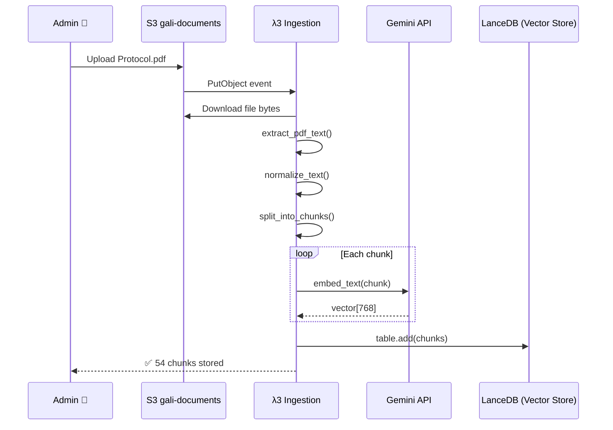

### Cleanup Flow (λ4)

> Purges **ephemeral session messages** from MongoDB (not vectors — those stay in LanceDB).

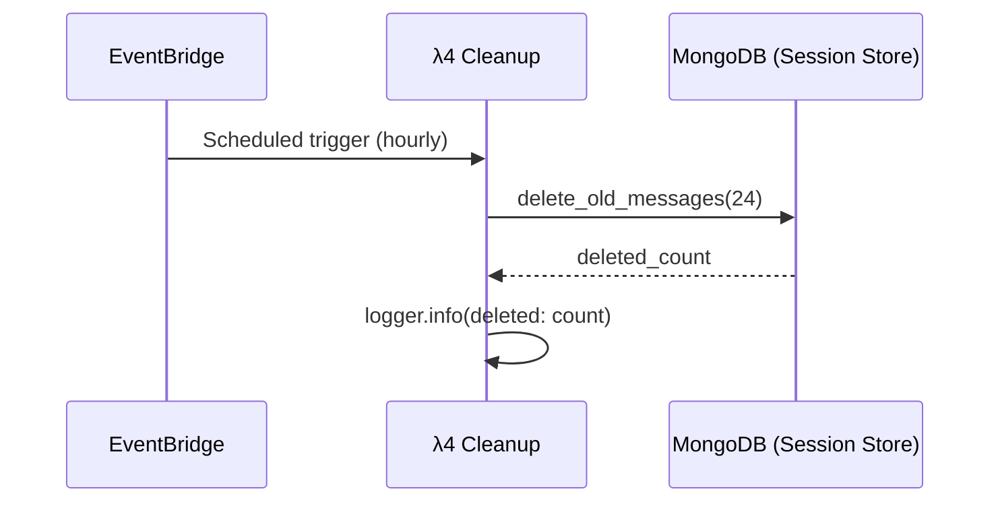

---

## File Migration Map

| Old (Monolith) | New (Microservices) | Change |
|----------------|---------------------|--------|
| `agent/server.py` | `endpoints/*/handler.py` | **Split** into 3 Lambda handlers |
| `agent/logger.py` | — | **Deleted** — replaced by Powertools `Logger` |
| `agent/config.py` | `shared/config.py` | **Moved** — reads from Secrets Manager |
| `agent/llm.py` | `endpoints/chat/llm.py` | **Moved** — only chat service needs it |
| `agent/vectorstore.py` | `endpoints/chat/vectorstore.py` | **Moved** — only chat service needs it |
| `agent/history.py` | `shared/db.py` | **Refactored** — becomes shared session store (chat history only, no RAG) |
| `agent/prompt.py` | `endpoints/chat/prompt.py` | **Moved** — only chat service needs it |
| `ingestion/main.py` | `data/handler.py` | **Rewritten** — S3 trigger instead of CLI |
| `ui/app.py` | `frontend/src/` | **Rewritten** — Next.js replaces Streamlit |
| `pyproject.toml` | `*/requirements.txt` | **Split** — each service has its own deps |

---

## Technology Stack Per Service

| Service | Runtime | Framework | Dependencies |
|---------|---------|-----------|-------------|
| **shared** | Python 3.12 | — | pymongo, aws-lambda-powertools |
| **session** | Python 3.12 | Powertools `APIGatewayHttpResolver` | pymongo |
| **chat** | Python 3.12 | Powertools `APIGatewayHttpResolver` | google-genai, lancedb, pymongo |
| **ingestion** | Python 3.12 | Powertools `Logger` + `Tracer` | pdfplumber, google-genai, lancedb, boto3 |
| **cleanup** | Python 3.12 | Powertools `Logger` | pymongo |
| **frontend** | Node 20 | Next.js 14 (React) | — |

---

## Future Roadmap: MongoDB → DynamoDB

> The initial deployment uses **MongoDB** as a **short-term session store** for ephemeral chat history.
> A future iteration will migrate to **AWS DynamoDB** for full AWS-native integration.
> **Note:** This migration affects only the session store. **LanceDB** remains the RAG vector store regardless.

### Why DynamoDB?

| | MongoDB Atlas | DynamoDB |
|---|---|---|
| **Hosting** | External service (MongoDB Inc.) | Native AWS — same account as Lambdas |
| **Connection** | URI string + pymongo driver | `boto3.resource("dynamodb")` — no connection needed |
| **Auth** | Username/password in Secrets Manager | **IAM role** — Lambda has access automatically |
| **Scaling** | Manual tier upgrades | Auto-scales (on-demand mode) |
| **TTL cleanup** | Need λ4 Cleanup Lambda (hourly cron) | **Built-in TTL** — DynamoDB auto-deletes expired items |
| **Cost** | Atlas free tier (512MB) | AWS free tier (25GB + 25 read/write units) |
| **Cold start** | pymongo connection overhead | Zero — boto3 is pre-installed in Lambda |

### What changes in code

Only **`shared/db.py`** changes. No other service is affected (that's the whole point of the shared layer).

```python
# Before (MongoDB)
from pymongo import MongoClient
client = MongoClient(mongo_uri)
col = client["gali"]["chat_history"]
col.insert_many(docs)
col.find({"session_id": sid})

# After (DynamoDB)
import boto3
table = boto3.resource("dynamodb").Table("gali-chat-history")
table.put_item(Item={...})
table.query(KeyConditionExpression=Key("session_id").eq(sid))
```

### DynamoDB table design

```
Table: gali-chat-history
├── Partition Key: session_id  (String)
├── Sort Key:      created_at  (Number — Unix timestamp)
├── Attributes:
│   ├── role       (String — "user" | "assistant")
│   ├── content    (String — message text)
│   └── expires_at (Number — Unix timestamp, TTL attribute)
└── TTL: enabled on "expires_at"
```

### λ4 Cleanup gets deleted

With DynamoDB TTL, expired messages are auto-deleted — no Lambda needed:

```python
# When saving a message, set expires_at = now + 24 hours
import time
item = {
    "session_id": sid,
    "created_at": int(time.time()),
    "role": "user",
    "content": text,
    "expires_at": int(time.time()) + 86400,  # 24h from now
}
table.put_item(Item=item)
# DynamoDB automatically deletes this item after 24 hours
```

### Architecture after DynamoDB migration

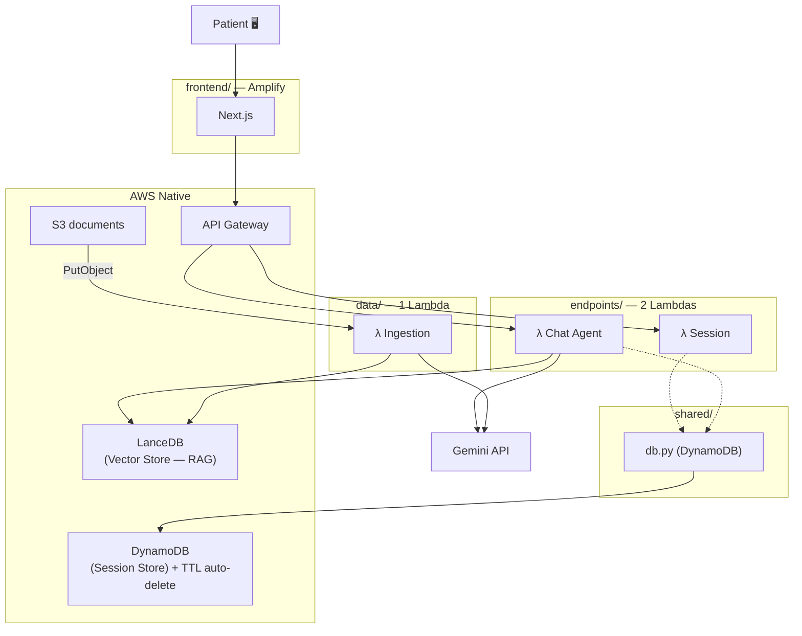

**Result**: 3 Lambdas instead of 4, zero external dependencies (no Atlas), fully AWS-native. LanceDB remains the RAG vector store.
