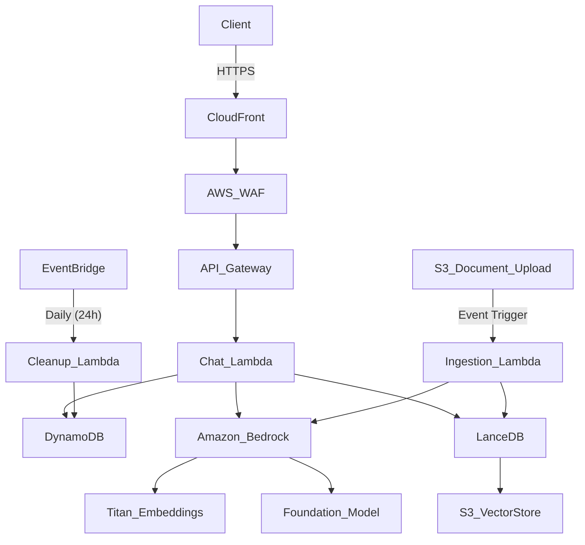
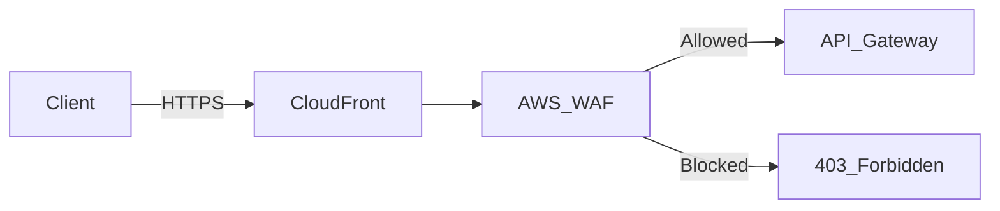
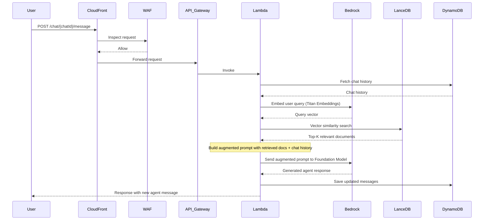
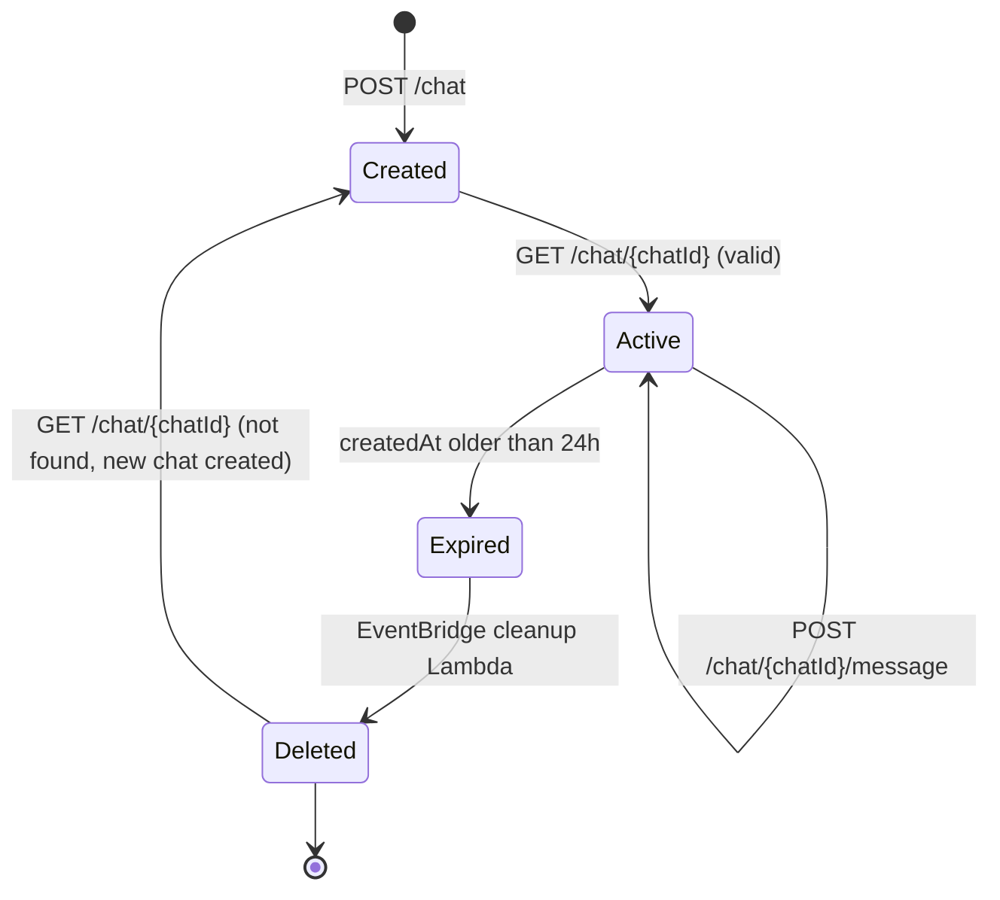
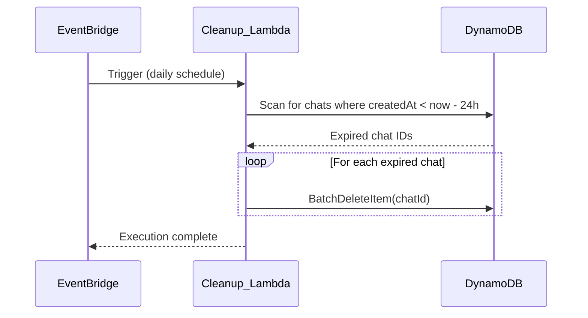
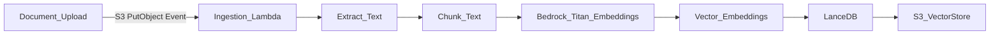

# Gali - Technical Documentation

## Table of Contents

- [1. Project Overview](#1-project-overview)
- [2. Architecture Overview](#2-architecture-overview)
- [3. Edge and Security Layer](#3-edge-and-security-layer)
- [4. API Endpoints](#4-api-endpoints)
- [5. Data Models](#5-data-models)
- [6. RAG Flow](#6-rag-flow)
- [7. Chat Lifecycle](#7-chat-lifecycle)
- [8. Cleanup Mechanism](#8-cleanup-mechanism)
- [9. Document Ingestion Pipeline](#9-document-ingestion-pipeline)
- [10. AWS Services Summary](#10-aws-services-summary)

---

## 1. Project Overview

**Gali** is a serverless Retrieval Augmented Generation (RAG) chatbot built entirely on AWS. It combines the language processing capabilities of foundation models (via Amazon Bedrock) with a serverless architecture to deliver accurate, contextually relevant responses grounded in an external knowledge base.

Key design principles:

- **Fully serverless** -- no idle compute, pay only for what you use.
- **Secure by default** -- all traffic passes through CloudFront with AWS WAF.
- **Ephemeral chats** -- conversations are automatically cleaned up after 24 hours.
- **RAG-powered** -- responses are augmented with relevant documents retrieved from a vector store.

---

## 2. Architecture Overview



### Component Summary

| Component | Service | Purpose |
|---|---|---|
| Edge / CDN | CloudFront | TLS termination, global edge routing, caching |
| Firewall | AWS WAF | Request filtering, rate limiting, bot control |
| API Layer | API Gateway | REST API routing, request validation |
| Chat Logic | Lambda (Chat) | Chat creation, validation, message handling, RAG orchestration |
| Chat Storage | DynamoDB | Persist chat sessions and message history |
| Vector Store | LanceDB on S3 | Store and query document embeddings |
| Embeddings | Bedrock (Titan) | Generate vector embeddings for queries and documents |
| LLM | Bedrock (Foundation Model) | Generate agent responses from augmented prompts |
| Ingestion | Lambda (Ingestion) | Process uploaded documents into embeddings |
| Cleanup | Lambda (Cleanup) | Delete expired chat sessions |
| Scheduler | EventBridge | Trigger daily cleanup |

---

## 3. Edge and Security Layer

All client traffic flows through an edge security layer before reaching the API:



### CloudFront

- Acts as the single entry point for all API requests.
- Provides TLS termination and HTTPS enforcement.
- Offers global edge routing for low-latency access.
- Can cache responses for read-heavy endpoints (e.g., chat validation).

### AWS WAF

- Attached directly to the CloudFront distribution.
- Protects against common web exploits:
  - SQL injection
  - Cross-site scripting (XSS)
  - Rate limiting (throttle abusive clients)
  - Bot control (block known malicious bots)
  - IP-based allow/deny lists
- Managed rule groups can be enabled for additional protection (e.g., AWS Managed Rules, OWASP Top 10).

---

## 4. API Endpoints

The API is exposed via API Gateway behind CloudFront + WAF. Full OpenAPI specification is available in [`openapi.yaml`](./openapi.yaml).

### 4.1 Create Chat

Creates a new chat session and returns a unique identifier.

- **Method**: `POST`
- **Path**: `/chat`
- **Request Body**: None
- **Response** (`201 Created`):

```json
{
  "chatId": "550e8400-e29b-41d4-a716-446655440000",
  "createdAt": "2026-02-11T10:30:00Z"
}
```

### 4.2 Validate Chat

Validates whether a chat session exists. If the chat has been deleted (expired), a new chat is automatically created with a new UUID.

- **Method**: `GET`
- **Path**: `/chat/{chatId}`
- **Path Parameter**: `chatId` (UUID)
- **Response** (`200 OK`) -- chat exists:

```json
{
  "chatId": "550e8400-e29b-41d4-a716-446655440000",
  "messages": [
    {
      "sender": "user",
      "message": "What is serverless RAG?"
    },
    {
      "sender": "agent",
      "message": "Serverless RAG combines retrieval augmented generation with..."
    }
  ],
  "createdAt": "2026-02-11T10:30:00Z"
}
```

- **Response** (`201 Created`) -- chat did not exist, new one created:

```json
{
  "chatId": "7c9e6679-7425-40de-944b-e07fc1f90ae7",
  "messages": [],
  "createdAt": "2026-02-11T12:00:00Z"
}
```

### 4.3 Send Message

Sends the full conversation history and receives a response with a new agent message appended.

- **Method**: `POST`
- **Path**: `/chat/{chatId}/message`
- **Path Parameter**: `chatId` (UUID)
- **Request Body**:

```json
{
  "chatId": "550e8400-e29b-41d4-a716-446655440000",
  "messages": [
    {
      "sender": "user",
      "message": "What is serverless RAG?"
    }
  ]
}
```

- **Response** (`200 OK`):

```json
{
  "chatId": "550e8400-e29b-41d4-a716-446655440000",
  "messages": [
    {
      "sender": "user",
      "message": "What is serverless RAG?"
    },
    {
      "sender": "agent",
      "message": "Serverless RAG combines the advanced language processing capabilities of foundation models with serverless architecture. It allows for dynamic retrieval of information from external sources, enabling generation of content that is accurate, contextually rich, and up-to-date."
    }
  ]
}
```

---

## 5. Data Models

### 5.1 Message

| Field | Type | Description |
|---|---|---|
| `sender` | `string` (enum: `user`, `agent`) | Who sent the message |
| `message` | `string` | The text content of the message |

### 5.2 Chat

| Field | Type | Description |
|---|---|---|
| `chatId` | `string` (UUID v4) | Unique identifier for the chat session |
| `messages` | `Message[]` | Ordered list of messages in the conversation |
| `createdAt` | `string` (ISO 8601) | Timestamp when the chat was created |

### 5.3 DynamoDB Table Schema

- **Table Name**: `gali-chats`
- **Partition Key**: `chatId` (String, UUID)

| Attribute | DynamoDB Type | Description |
|---|---|---|
| `chatId` | `S` (String) | Primary key -- UUID v4 |
| `messages` | `L` (List of Maps) | Each map contains `sender` (S) and `message` (S) |
| `createdAt` | `S` (String) | ISO 8601 timestamp, used by cleanup to determine expiry |

> **Note**: A Global Secondary Index (GSI) on `createdAt` can be added to optimize the cleanup scan query, though for moderate volumes a full table scan with a filter expression is sufficient.

---

## 6. RAG Flow

When a user sends a message, the system retrieves relevant documents from the knowledge base to augment the prompt before sending it to the LLM.



### RAG Steps Explained

1. **Receive request**: The user's message arrives through CloudFront -> WAF -> API Gateway -> Lambda.
2. **Fetch history**: Lambda retrieves the existing chat history from DynamoDB.
3. **Embed query**: The user's latest message is sent to Amazon Bedrock Titan Embeddings to generate a vector representation.
4. **Vector search**: The query vector is used to perform a similarity search in LanceDB (backed by S3) to find the most relevant documents.
5. **Build prompt**: The retrieved documents are combined with the chat history and the user's message into an augmented prompt.
6. **Generate response**: The augmented prompt is sent to the foundation model (via Bedrock) which generates a contextually grounded response.
7. **Persist**: The new agent message is appended to the chat history in DynamoDB.
8. **Return**: The full updated message list is returned to the client.

---

## 7. Chat Lifecycle



### Lifecycle Summary

1. **Created**: A new chat is created via `POST /chat`. A UUID and `createdAt` timestamp are generated.
2. **Active**: The chat is in use. Messages are exchanged via `POST /chat/{chatId}/message`. The chat can be validated at any time via `GET /chat/{chatId}`.
3. **Expired**: The chat's `createdAt` timestamp is older than 24 hours. It is eligible for deletion.
4. **Deleted**: The EventBridge-triggered cleanup Lambda removes the chat from DynamoDB.
5. **Re-created**: If a client calls `GET /chat/{chatId}` for a deleted chat, a new chat is automatically created with a new UUID. The frontend should update its local reference to the new `chatId`.

---

## 8. Cleanup Mechanism

Chats are ephemeral and expire after 24 hours. A scheduled cleanup process handles deletion.



### Details

- **Schedule**: EventBridge rule triggers the Cleanup Lambda once per day (e.g., `cron(0 3 * * ? *)` -- daily at 03:00 UTC).
- **Logic**: The Lambda scans the DynamoDB table, filtering for records where `createdAt` is older than 24 hours from the current time.
- **Deletion**: Matching records are deleted in batches using `BatchWriteItem` (up to 25 items per batch).
- **Frontend handling**: When the frontend calls `GET /chat/{chatId}` and the chat no longer exists, the endpoint returns a `201` with a new chat. The frontend should replace its stored `chatId` with the new one.

---

## 9. Document Ingestion Pipeline

The knowledge base is populated through an event-driven ingestion pipeline that converts documents into vector embeddings.



### Ingestion Steps

1. **Upload**: A document is uploaded to an S3 bucket (the knowledge base source bucket).
2. **Trigger**: The S3 `PutObject` event triggers the Ingestion Lambda.
3. **Extract**: The Lambda extracts text content from the document (supports PDF, TXT, DOCX, etc.).
4. **Chunk**: The text is split into manageable chunks (e.g., 512-token segments with overlap).
5. **Embed**: Each chunk is sent to Amazon Bedrock Titan Embeddings to produce a vector representation.
6. **Store**: The vectors (along with metadata and source text) are stored in LanceDB, which persists data to S3.

### Key Considerations

- LanceDB operates serverlessly -- it reads/writes directly to S3, so there is no database server to manage.
- Documents up to 500MB can be processed without issues (per AWS reference architecture benchmarks).
- Lambda cold starts are minimal; the majority of processing time is spent on embedding calculation in Bedrock.

---

## 10. AWS Services Summary

| Service | Role |
|---|---|
| **Amazon CloudFront** | CDN, TLS termination, global edge routing |
| **AWS WAF** | Web application firewall, request filtering, rate limiting |
| **Amazon API Gateway** | REST API routing, request/response validation |
| **AWS Lambda** | Serverless compute for chat logic, ingestion, and cleanup |
| **Amazon DynamoDB** | NoSQL database for chat session and message storage |
| **Amazon S3** | Object storage for vector database (LanceDB) and document uploads |
| **Amazon Bedrock** | Managed access to Titan Embeddings and foundation models (LLM) |
| **LanceDB** | Open-source serverless vector database (S3-backed) |
| **Amazon EventBridge** | Scheduled rules for daily cleanup triggers |

---

## References

- [Serverless RAG on AWS](https://aws.amazon.com/startups/learn/serverless-retrieval-augmented-generation-on-aws#overview)
- [Amazon Bedrock Documentation](https://docs.aws.amazon.com/bedrock/)
- [LanceDB Documentation](https://lancedb.github.io/lancedb/)
- [OpenAPI Specification (Swagger)](./openapi.yaml)
